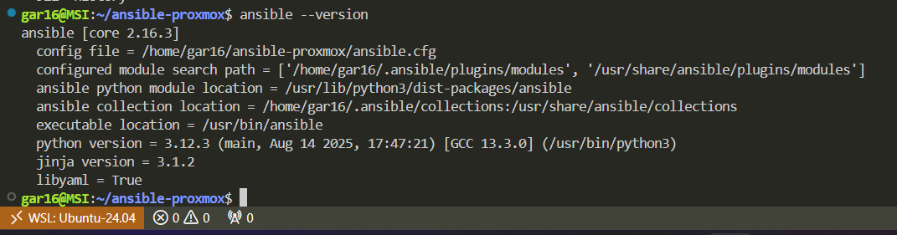
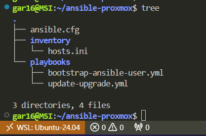
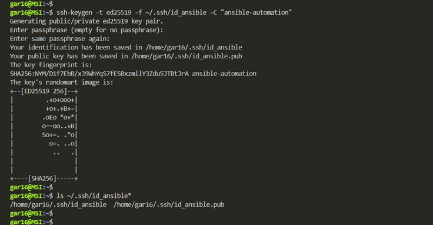
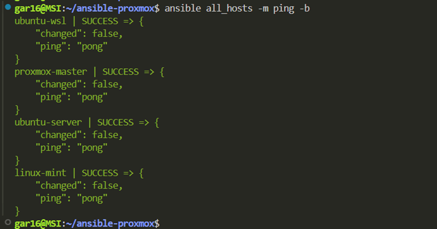
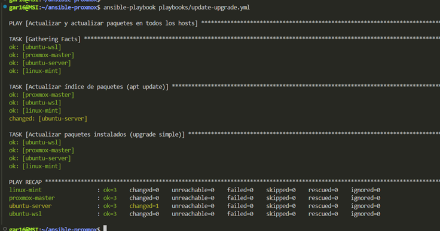
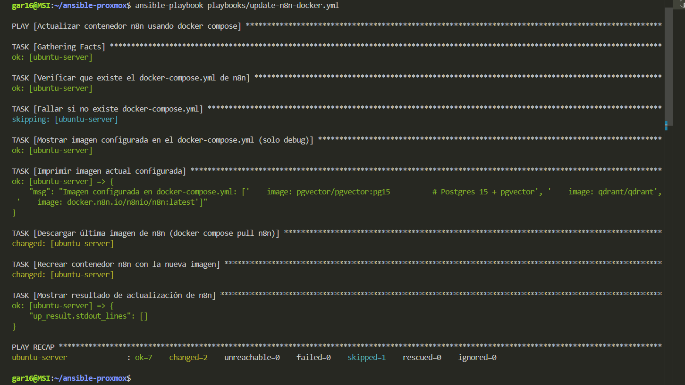
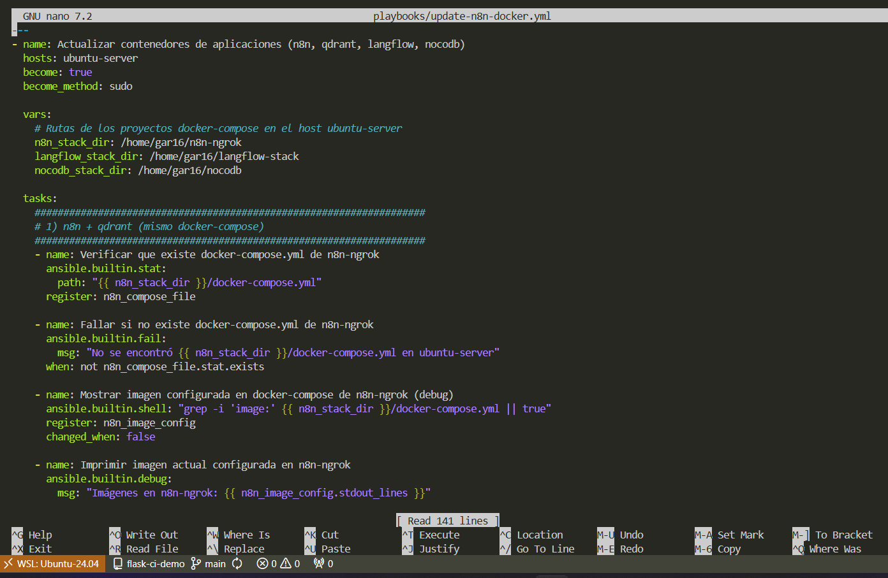

# 🚀 Automatización de Servidores Linux con Ansible (Homelab)

<div align="center">


**Gestión centralizada de actualizaciones en varios servidores usando Ansible desde WSL** 🧩

</div>

---

## 📋 Tabla de Contenidos

- [🎯 Objetivo](#-objetivo)
- [🏗 Arquitectura del Laboratorio](#-arquitectura-del-laboratorio)
- [📦 Requisitos Previos](#-requisitos-previos)
- [📁 Estructura del Proyecto](#-estructura-del-proyecto)
- [🧩 Inventario Ansible](#-inventario-ansible)
- [⚙️ Configuración Global](#️-configuración-global-ansiblecfg)
- [🔐 Clave SSH para Automatización](#-clave-ssh-para-automatización)
- [👤 Usuario de Servicio en los Nodos](#-usuario-de-servicio-en-los-nodos)
- [🛡 Configuración de sudo](#-configuración-de-sudo-para-el-usuario-de-servicio)
- [✅ Pruebas de Conectividad](#-pruebas-de-conectividad-con-ansible)
- [📝 Playbook de Actualización](#-playbook-de-actualización-de-paquetes)
- [▶️ Ejecución del Playbook](#️-ejecución-del-playbook)
- [🔎 Troubleshooting](#-troubleshooting-básico)
- [🔐 Notas de Seguridad](#-notas-de-seguridad)

---

## 🎯 Objetivo

Este documento describe cómo:

- Configurar **Ansible** en un **Ubuntu WSL** que actúa como **nodo de control**.
- Administrar varios servidores Linux (Proxmox, Ubuntu, Linux Mint, etc.) como **nodos gestionados**.
- Usar un **usuario de servicio dedicado** (por ejemplo `ansible-svc`) con:
  - Acceso por **clave SSH**.
  - Permisos `sudo` sin contraseña (solo para laboratorio).
- Ejecutar un **playbook de actualización (`apt update` + `apt upgrade`)** en todos los nodos de forma centralizada.

---

## 🏗 Arquitectura del Laboratorio

- **Nodo de control** (donde corre Ansible):
  - Ubuntu 24.04 en WSL2.
  - Usuario local de ejemplo: `labuser`.

- **Nodos gestionados** (ejemplo de homelab):
  - `node-wsl` → el propio WSL tratado como host gestionado.
  - `node-proxmox` → Proxmox VE.
  - `node-ubuntu` → Ubuntu Server (por ejemplo, accesible por Tailscale o red local).
  - `node-mint` → Linux Mint.

> Todos los nombres e IP de ejemplo se pueden adaptar a tu entorno (no se usan datos reales).

---

## 📦 Requisitos Previos

### En el nodo de control (WSL)

- Ubuntu actualizado:
  ```bash
  sudo apt update && sudo apt upgrade -y
  ```

- Ansible instalado:
  ```bash
  sudo apt install -y ansible
  ```



### En los nodos gestionados

- Sistema basado en Debian/Ubuntu (Proxmox, Ubuntu Server, Linux Mint).
- Servicio SSH activo y accesible desde el nodo de control.
- Python 3 instalado (normalmente viene por defecto).

---

## 📁 Estructura del Proyecto

En el nodo de control (WSL):

```bash
cd ~
mkdir -p ansible-homelab/inventory
mkdir -p ansible-homelab/playbooks
cd ansible-homelab
```

Estructura:

```
ansible-homelab/
├── inventory/
│   └── hosts.ini
├── playbooks/
│   └── update-upgrade.yml
├── ansible.cfg

```



---

## 🧩 Inventario Ansible

**Archivo:** `inventory/hosts.ini`

```ini
[local_wsl]
node-wsl ansible_connection=local ansible_user=ansible-svc

[proxmox]
node-proxmox ansible_host=10.10.0.10 ansible_user=ansible-svc

[ubuntu]
node-ubuntu ansible_host=10.10.0.11 ansible_user=ansible-svc

[mint]
node-mint ansible_host=10.10.0.12 ansible_user=ansible-svc

[all_hosts:children]
local_wsl
proxmox
ubuntu
mint

[all_hosts:vars]
ansible_python_interpreter=/usr/bin/python3
ansible_ssh_private_key_file=~/.ssh/id_ansible_homelab
```

### Notas

- `node-wsl`, `node-proxmox`, `node-ubuntu`, `node-mint` son nombres lógicos, no tienen por qué coincidir con el hostname real.
- `ansible_host` → IP o FQDN real del servidor.
- `ansible_user=ansible-svc` → usuario de servicio que se creará en cada nodo.
- `ansible_connection=local` en `node-wsl` indica que las tareas se ejecutan localmente.

---

## ⚙️ Configuración Global `ansible.cfg`

**Archivo:** `ansible.cfg` en la raíz del proyecto:

```ini
[defaults]
inventory           = ./inventory/hosts.ini
remote_user         = ansible-svc
host_key_checking   = False
forks               = 10
interpreter_python  = /usr/bin/python3
```

### Explicación

- `inventory` → ruta por defecto al inventario.
- `remote_user` → usuario remoto por defecto (coincide con el de hosts.ini).
- `host_key_checking=False` → evita confirmación interactiva de huellas SSH (útil en laboratorio).
- `forks` → cantidad de hosts que Ansible puede gestionar en paralelo.

---

## 🔐 Clave SSH para Automatización

Creación de una clave SSH solo para Ansible (no se usa la clave personal):

En el nodo de control (WSL), como `labuser`:

```bash
cd ~
ssh-keygen -t ed25519 -f ~/.ssh/id_ansible_homelab -C "ansible-homelab"
```

Deja la passphrase vacía o define una (según tu modelo de seguridad).

Se generan:

- `~/.ssh/id_ansible_homelab` → clave privada (NO subir a Git).
- `~/.ssh/id_ansible_homelab.pub` → clave pública (se copia a los nodos).



---

## 👤 Usuario de Servicio en los Nodos

En cada nodo se crea un usuario dedicado para Ansible, por ejemplo: `ansible-svc`.

### Ejemplo en un nodo (node-ubuntu)

Desde WSL, usando tu usuario administrativo normal (ej. `ssh admin@10.10.0.11`):

```bash
ssh admin@10.10.0.11
```

Dentro del servidor:

```bash
sudo useradd -m -s /bin/bash ansible-svc
sudo passwd ansible-svc      # asignar contraseña temporal (solo para bootstrap)
```

Para copiar la clave pública del nodo de control:

En el nodo de control (WSL):

```bash
ssh-copy-id -i ~/.ssh/id_ansible_homelab.pub ansible-svc@10.10.0.11
```

Repite el mismo procedimiento para `node-proxmox` y `node-mint` (adaptando IPs).

### Verificación rápida de acceso SSH

En el nodo de control (WSL):

```bash
ssh -i ~/.ssh/id_ansible_homelab ansible-svc@10.10.0.11
```

Si el acceso funciona sin pedir contraseña, la clave está bien configurada.

---

## 🛡 Configuración de `sudo` para el Usuario de Servicio

> ⚠️ **Advertencia:** Esto está pensado para laboratorio/homelab. En producción se recomendaría una política más restrictiva.

En cada nodo, se configura `sudo` para que `ansible-svc` pueda ejecutar comandos como root sin introducir contraseña.

En el nodo (ejemplo `node-ubuntu`):

```bash
echo 'ansible-svc ALL=(ALL) NOPASSWD:ALL' | sudo tee /etc/sudoers.d/99-ansible-svc
sudo visudo -cf /etc/sudoers.d/99-ansible-svc
```

El comando `visudo -cf` debe devolver algo como:

```
/etc/sudoers.d/99-ansible-svc: parsed OK
```

### Prueba rápida

```bash
sudo -u ansible-svc sudo -n whoami
```

Debe devolver:

```
root
```

sin pedir contraseña.


---

## ✅ Pruebas de Conectividad con Ansible

En el nodo de control:

```bash
cd ~/ansible-homelab
```

### 1️⃣ Ping sin sudo

```bash
ansible all_hosts -m ping
```

**Salida esperada:**

```
node-wsl       | SUCCESS => {"changed": false, "ping": "pong"}
node-proxmox   | SUCCESS => {"changed": false, "ping": "pong"}
node-ubuntu    | SUCCESS => {"changed": false, "ping": "pong"}
node-mint      | SUCCESS => {"changed": false, "ping": "pong"}
```

### 2️⃣ Ping con sudo (become)

```bash
ansible all_hosts -m ping -b
```

- `-b` → usa become (sudo).
- Confirma que el usuario `ansible-svc` puede usar sudo sin contraseña.



---

## 📝 Playbook de Actualización de Paquetes

**Archivo:** `playbooks/update-upgrade.yml`

```yaml
---
- name: Actualizar y actualizar paquetes en todos los hosts
  hosts: all_hosts
  become: true
  become_method: sudo

  tasks:
    - name: Actualizar índice de paquetes (apt update)
      ansible.builtin.apt:
        update_cache: yes
        cache_valid_time: 3600

    - name: Actualizar paquetes instalados (upgrade simple)
      ansible.builtin.apt:
        upgrade: yes
```

### Explicación rápida

- `hosts: all_hosts` → se ejecuta en todos los nodos definidos bajo `all_hosts`.
- `become: true` → las tareas se ejecutan como root mediante sudo.
- **Primera tarea:**
  - `update_cache: yes` → equivalente a `apt update`.
  - `cache_valid_time: 3600` → si la caché tiene menos de 1 hora no se vuelve a actualizar.
- **Segunda tarea:**
  - `upgrade: yes` → actualización estándar de paquetes (`apt upgrade`).

---

## ▶️ Ejecución del Playbook

Desde `ansible-homelab` en el nodo de control:

```bash
ansible-playbook playbooks/update-upgrade.yml
```

**Ejemplo de resumen final:**

```
PLAY RECAP
node-mint      : ok=3  changed=0  failed=0
node-proxmox   : ok=3  changed=0  failed=0
node-ubuntu    : ok=3  changed=1  failed=0
node-wsl       : ok=3  changed=0  failed=0
```

- `ok` → tareas ejecutadas correctamente.
- `changed` → indica que hubo cambios (por ejemplo, se instalaron actualizaciones).
- `failed` → debe ser 0 en todos los nodos.



---
## 🐳 Playbook de Actualización de Contenedores Docker (n8n, Qdrant, Langflow, Nocodb)

Además de actualizar paquetes del sistema, Ansible también puede automatizar la actualización de contenedores Docker que se gestionan con `docker compose`.

En este ejemplo se actualizan varios servicios de aplicaciones que corren en el host `node-ubuntu`:

* Stack `n8n-ngrok` → servicios `n8n` y `qdrant`.
* Stack `langflow-stack` → servicio `langflow`.
* Stack `nocodb` → servicio `nocodb`.

### 🧩 Playbook de ejemplo

Archivo: `playbooks/update-docker-apps.yml`
```yaml
---
- name: Actualizar contenedores de aplicaciones (n8n, qdrant, langflow, nocodb)
  hosts: node-ubuntu
  become: true
  become_method: sudo

  vars:
    n8n_stack_dir: /home/labuser/n8n-ngrok
    langflow_stack_dir: /home/labuser/langflow-stack
    nocodb_stack_dir: /home/labuser/nocodb

  tasks:
    - name: Descargar últimas imágenes de n8n y qdrant
      ansible.builtin.command:
        cmd: "docker compose pull n8n qdrant"
        chdir: "{{ n8n_stack_dir }}"

    - name: Recrear contenedores n8n y qdrant con nuevas imágenes
      ansible.builtin.command:
        cmd: "docker compose up -d --force-recreate n8n qdrant"
        chdir: "{{ n8n_stack_dir }}"

    - name: Descargar y actualizar langflow
      ansible.builtin.command:
        cmd: "docker compose pull langflow && docker compose up -d --force-recreate langflow"
        chdir: "{{ langflow_stack_dir }}"

    - name: Descargar y actualizar nocodb
      ansible.builtin.command:
        cmd: "docker compose pull nocodb && docker compose up -d --force-recreate nocodb"
        chdir: "{{ nocodb_stack_dir }}"
```

🔒 **Importante:** Este playbook no elimina volúmenes. `docker compose up -d --force-recreate` recrea los contenedores con la nueva imagen pero mantiene los volúmenes y datos existentes.



### 📌 Explicación rápida

* `hosts: node-ubuntu` → solo se ejecuta en el servidor donde viven esos `docker-compose.yml`.
* `become: true` → se necesitan permisos de root para ejecutar `docker compose`.
* `n8n_stack_dir`, `langflow_stack_dir`, `nocodb_stack_dir` → rutas donde viven los respectivos `docker-compose.yml`.
* Para cada stack se hace:
   1. `docker compose pull <servicio>` → descarga la última imagen disponible.
   2. `docker compose up -d --force-recreate <servicio>` → recrea el contenedor usando esa imagen.

### ▶️ Ejecución del Playbook

Desde el nodo de control:
```bash
ansible-playbook playbooks/update-docker-apps.yml
```

Ejemplo de resumen final:
```
PLAY RECAP
node-ubuntu : ok=6  changed=4  failed=0  skipped=0  rescued=0  ignored=0
```

* `ok` → tareas ejecutadas correctamente.
* `changed` → indica que se descargaron imágenes nuevas o se recrearon contenedores.
* `failed` → debe ser 0.
* 


---
## 🔎 Troubleshooting Básico

### Missing sudo password

Verifica que exista `/etc/sudoers.d/99-ansible-svc` en el nodo:

```bash
sudo cat /etc/sudoers.d/99-ansible-svc
sudo visudo -cf /etc/sudoers.d/99-ansible-svc
```

Comprueba desde el nodo:

```bash
sudo -u ansible-svc sudo -n whoami
```

Si pide contraseña, la configuración de sudo no está aplicada correctamente.

### Permission denied (publickey,password)

Asegúrate de que la clave pública está en `~ansible-svc/.ssh/authorized_keys`:

```bash
sudo ls -l /home/ansible-svc/.ssh
sudo cat /home/ansible-svc/.ssh/authorized_keys
```

Repite `ssh-copy-id` si es necesario (desde WSL):

```bash
ssh-copy-id -i ~/.ssh/id_ansible_homelab.pub ansible-svc@IP_DEL_NODO
```

### Errores de Python

Comprueba que `python3` existe en el nodo:

```bash
which python3
```

Si está en otra ruta, ajusta `ansible_python_interpreter` en `hosts.ini`.

---

## 🔐 Notas de Seguridad

### ⚠️ No subas nunca a GitHub

- Claves privadas (`id_ansible_homelab`).
- Archivos con secretos en texto plano.

### Para laboratorios y homelabs

El uso de:

```
ansible-svc ALL=(ALL) NOPASSWD:ALL
```

está pensado **únicamente para laboratorios y homelabs**.

### En entornos de producción

- Usa un usuario de servicio **limitado**.
- **Restringe los comandos** permitidos en sudoers.
- Añade controles de acceso adicionales:
  - MFA (autenticación multifactor)
  - Bastion host
  - Segmentación de red
  - Auditoría de logs

---

## 🤝 Contribuir

¿Mejoras o sugerencias? ¡Pull requests bienvenidos!

1. Fork el proyecto
2. Crea tu rama: `git checkout -b feature/nueva-funcionalidad`
3. Commit: `git commit -m 'Añade nueva funcionalidad'`
4. Push: `git push origin feature/nueva-funcionalidad`
5. Abre un Pull Request

---

## 📄 Licencia

Este proyecto es libre de usar para propósitos educativos y de laboratorio.

---

## 🙏 Agradecimientos

- [Ansible Documentation](https://docs.ansible.com/)
- [Ansible Galaxy](https://galaxy.ansible.com/)
- [Ubuntu WSL](https://ubuntu.com/wsl)

---

<div align="center">

**⭐ Si este README te ayuda a montar tu homelab con Ansible, no olvides versionarlo en tu repo y seguir iterando con nuevos roles y playbooks! ⭐**

Hecho con ❤️ para homelabs y automatización

</div>
